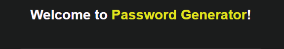
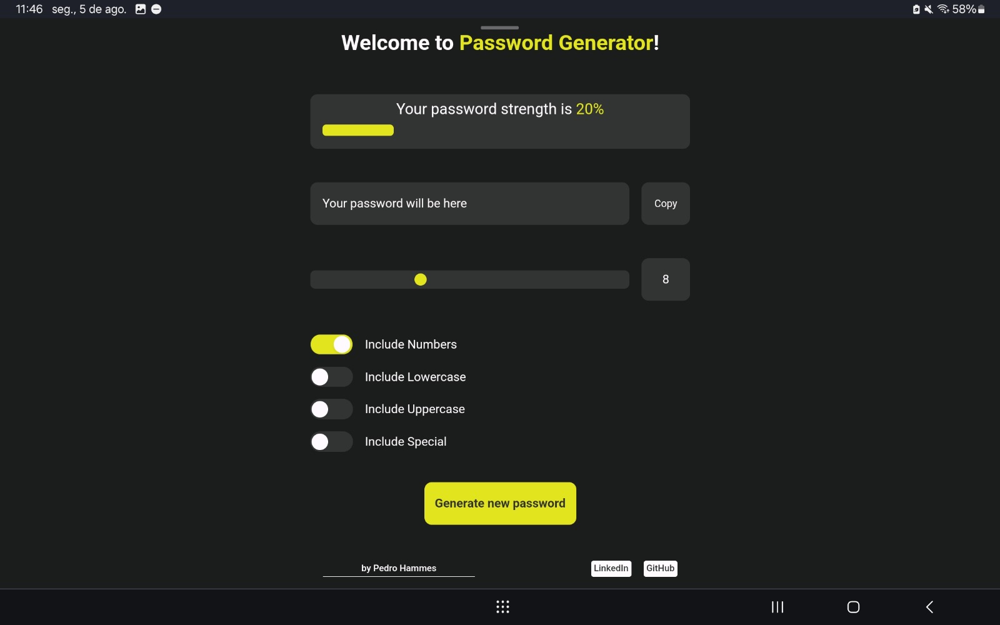
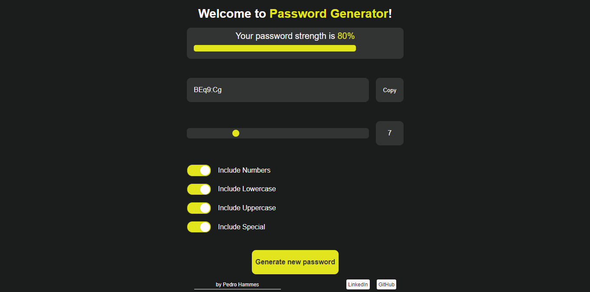

# Password Generator (PwG)


	

## Sobre o PwG
Password Generator é uma aplicação web capaz de gerar senhas aleatórias, com regras definidas pelo usuário.

A aplicações foi desenvolvida com React, JavaScript e CSS.

Desenvolvi esta aplicação tendo em mente dois objetivos principais: 

1.  Praticar e desenvolver minhas habilidades com o React (só não esperava que as sucessivas dificuldades em centralizar uma div fossem me levar a desenvolver também minhas habilidades com CSS :P )
2. Além disso, claro, tinha em mente o objetivo de acrescentar um bom projeto ao meu portfólio.

Com o PwG levei minhas habilidades em desenvolvimento web ao limite e o ultrapassei.
Me sinto mais capacitado e autoconfiante agora do que era antes do projeto.

## Instrução e instalação

1. Faça o clone do repositório
2. Abra o terminal
3. Navegue até a pasta onde o projeto foi clonado
3. Execute o comando abaixo
````
npm run dev
````
4. Clique no link para visualizar o projeto no navegador

Você também pode visualizar o projeto aqui: [Password Generator](https://pedrohammes.github.io/Password-Generator/)

## Instruções de uso
* Defina o tamanho da senha desejada
* Escolha as características desejadas para sua senha
* Quanto mais requisitos sua senha atender, maior será a barra de força (Strength).
* Os atributos que fazem sua senha ser mais forte são: números, minúsculas, maiúsculas, símbolos e ter mais de 7 caracteres.

> Atenção: selecione no mínimo uma característica para sua senha, caso contrário será retornada uma mensagem de erro.

## Imagens do projeto



